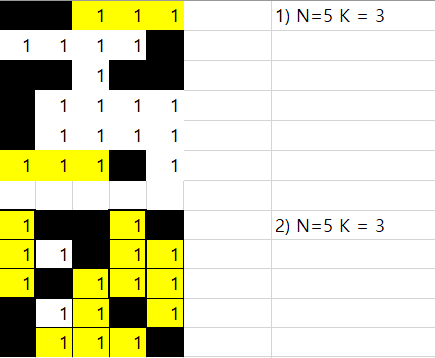

# 08/12 List II - 문제풀이

| No.  | Title         | Directory         |
| ---- | ------------- | ----------------- |
| 4836 | 색칠하기 | `4836_색칠하기` |
| 4837 | 부분집합의 합 | `4837_부분집합의합` |
| 4839 | 이진탐색 | `4839_이진탐색` |
| 4843 | 특별한정렬 | `4843_특별한정렬` |
| 1210 | ladder1 | `1210_ladder1` |
| 2001 | 파리퇴치 | `2001_파리퇴치` |
| 1979 | 어디에 단어가 들어갈 수 있을까 | `1979_어디에단어가` |

> 1979 어디에 단어가 들어갈 수 있을 까

#### 고민점

처음 문제를 보고는, 어디에 단어가 들어갈지 정확히 이해하지 못했다. 

그래서, 엑셀을 통해 직접 그림을 그려보며 가로, 세로 낱말이 어디에 들어갈지 조건이 무엇일지를 고민해보았다. 

단어는 1에 해당하는 빈 자리에만 들어갈 수 있고, 자리가 남으면 안되며 양 옆, 위 아래가 검정칸 , 0인 경우 들어갈 수 있음을 확인했다. 

이후, for 문을 통해 가로 세로 반복을 돌리며 확인하였다. 
