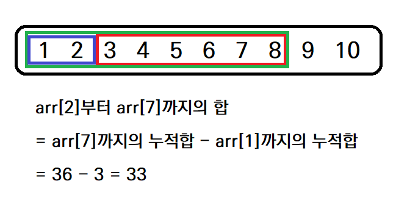
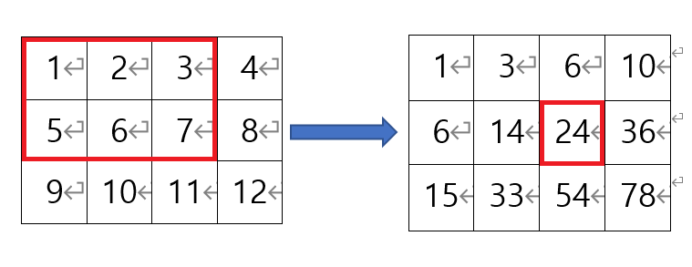
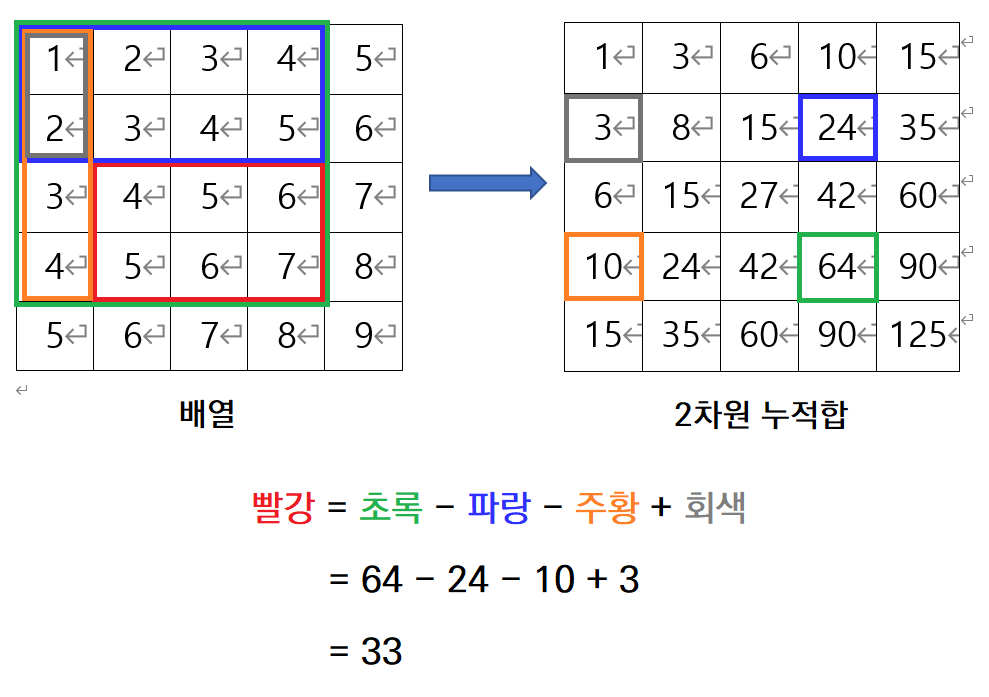

## 1. 구간 합과 누적 합

아래와 같은 배열에서 특정 구간의 요소들의 합을 구하는 상황을 생각해보자.

```python
arr = [1, 2, 3, 4, 5, 6, 7, 8, 9, 10]
```

예를 들어, `arr[2]`부터 `arr[7]`까지의 구간의 합을 구하기 위해서는 `3 + 4 + 5 + 6 + 7 + 8 = 33`과 같은 방식으로 구해야 한다. 

그런데 배열의 크기가 크고, 구간합을 여러번 구해야 할 경우 매번 모든 값을 일일이 더하는 것은 비효율적인데, 이때 사용될 수 있는 것이 **구간 합**이다.

구간 합은 **누적 합**을 통해 구할 수 있다.

#### 누적 합

- 배열의 첫 번째 요소부터 해당 요소까지의 합
```python
arr = [1, 2, 3, 4, 5, 6, 7, 8, 9, 10]
# 누적 합 배열
accumulate = [1, 3, 6, 10, 15, 21, 28, 36, 45, 55]
# accumulate[4] = arr[0] + arr[1] + arr[2] + arr[3] + arr[4]
```

#### 구간 합

- 배열의 특정 구간의 요소들의 합
- `i`번째부터 `j`번째까지의 구간 합 = `j`번째까지의 누적 합 - `i - 1  `번째까지의 누적 합
```python
# 누적 합 배열
accumulate = [1, 3, 6, 10, 15, 21, 28, 36, 45, 55]

# arr[2]에서 arr[7]까지의 구간 합 = accumulate[7] - accumulate[1]
# arr[5]에서 arr[9]까지의 구간 합 = accumulate[9] - accumulate[4]
```



## 2. 2차원 구간 합

이 문제에서는 위의 구간 합 방식을 2차원에 적용해 보았다.

#### 2차원 누적 합

- 배열의 `(0, 0)`을 왼쪽 위 모서리, `(r, c)`를 오른쪽 아래 모서리로 가지는 직사각형 내의 모든 요소의 합



```python
arr = [[1, 2, 3, 4], [5, 6, 7, 8], [9, 10, 11, 12]]

# 2차원 누적 합
accumulate = [[1, 3, 6, 10], [6, 14, 24, 36], [15, 33, 54, 78]]
# accumulate[1][1] = arr[0][0] + arr[0][1] + arr[1][0] + arr[1][1]
# accumulate[1][2] = arr[0][0] + arr[0][1] + arr[0][2] + arr[1][0] + arr[1][1] + arr[1][2]
```

#### 2차원 구간 합

- `(r1, c1)`을 왼쪽 위 모서리, `(r2, c2)`를 오른쪽 아래 모서리로 가지는 직사각형의 모든 요소의 합
- `accumulate[r2][c2] - accumulate[r2][c1 - 1] - accumulate[r1 - 1][c2] + accumulate[r1][c1]`
  - 아래 그림을 통해 위와 같은 식이 나오는 이유를 이해해보자.



## 3. 코드 설명

왼쪽 위 모서리의 좌표가 `(r, c)`이고 한 변의 길이가 M인 정사각형의 오른쪽 아래 모서리의 좌표는 `(r + M - 1, c + M - 1)`이다.

그래서 왼쪽 위 모서리의 좌표가 `(r, c)`이고 한 변의 길이가 M인 정사각형의 모든 요소의 합은

위의 2차원 구간 합 공식에서 

- `r1`, `c1`에 각각 `r`과 `c`를 넣고

- `r2`, `c2`에 각각 `r + M - 1`, `c + M -1`을 넣으면 구할 수 있다.

`r`이 0이거나 `c`가 0인 경우는 인덱스 에러가 발생할 수 있으므로 따로 처리해야 한다. 

```python
def get_max(board, N, M):
    """
    2차원 배열에서 주어진 크기의 정사각형을 선택했을 때
    그 안에 있는 요소의 합의 최대값을 구한다.

    board: 주어진 2차원 배열
    N: board의 가로, 세로 길이
    M: 정사각형의 가로, 세로 길이
    """
    accumulate = get_accumulate(board, N)
    max_value = 0

    for r in range(N - M + 1):
        for c in range(N - M + 1):
            current = accumulate[r - 1 + M][c - 1 + M]
            if r > 0:
                current -= accumulate[r - 1][c - 1 + M]
            if c > 0:
                current -= accumulate[r - 1 + M][c - 1]
            if r > 0 and c > 0:
                current += accumulate[r - 1][c - 1]

            if current > max_value:
                max_value = current

    return max_value
```
