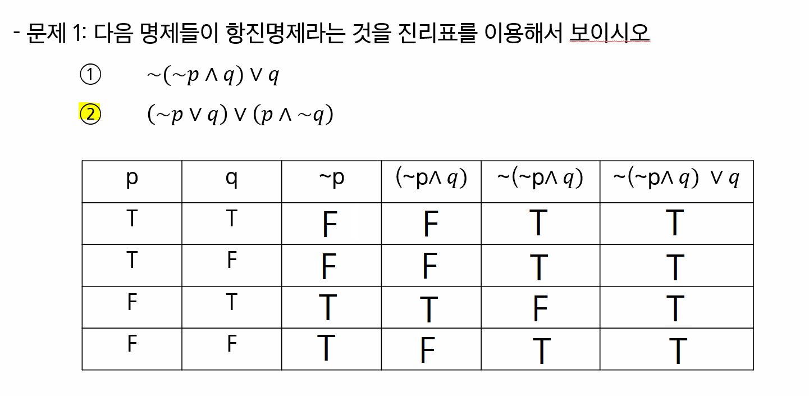
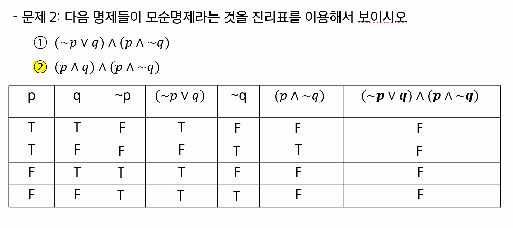
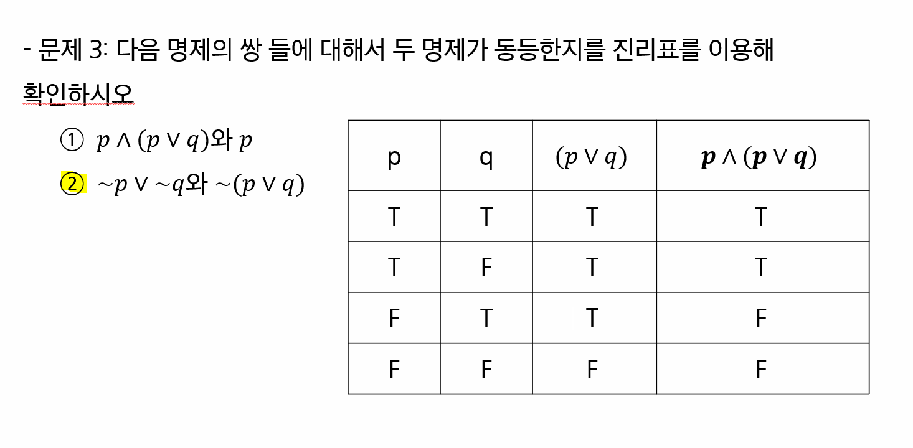
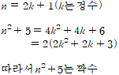
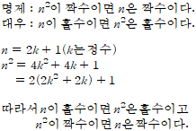
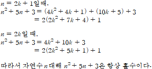
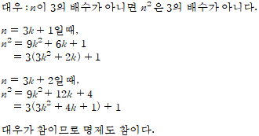

# 1. 논리와 증명 (안재영, 장효정, 정미소, 최상진)

### 문제 1.

### 문제 2.

### 문제 3.

 동등함!

### 문제 4.

(p ∨ ~q) ∧ (~p ∨ ~q)

(p ∧ ~p) ∨ ~q

~q

### 문제 5.

##### 5-2번

참

##### 5-4번

거짓

### 문제 7.

    

### 문제 9.

    

### 문제 10.

    

### 문제 11.

    

### 문제 12.

    