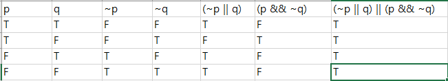
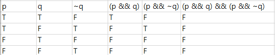
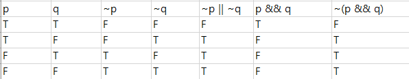

#### 조장: 손형선

#### 조원: 김지호, 노예람, 이승태 

<hr>

##### 1-2.



##### 2-2.



##### 3-2.



##### 4-2.

```
(p ∨ ¬q) ∧ (¬p ∨ ¬q)

(p ∧ ¬p) ∨ (¬q)

F ∨ ¬q

¬q
```

##### 5-2.

$$
x^2 - x \geq 0
\\
x(x-1) \geq 0
\\
(x \leq 0) \or (x \geq 1)
\\
True
$$

##### 5-4.

$$
x^2 \lt x 
\\
x(x-1) \lt 0
\\
0 \lt x \lt 1
\\
False
$$

##### 7. 

$$
n = 2k + 1, (k \geq 0)
\\
n^2 + n
\\= n(n + 1)
\\= (2k + 1)(2k + 2)
\\= 2(2k + 1)(k + 1)
$$

##### 9.

$$
n = 2k + 1, (k \geq 0)
\\n^2 + 5
\\= (2k + 1)^2 + 5
\\= 4k^2 + 4k + 6
\\= 2(2k^2 + 2k + 3)
$$

##### 10.

$$
(대우)
\\n = 2k + 1, (k \geq 0)
\\n^2
\\=4k^2 + 4k + 1
\\=2(2k^2 + 2k) + 1
$$

##### 11.

$$
(짝수)
\\n = 2k, (k \geq 0)
\\n^2 + 5n + 3
\\=4k^2 + 10k + 3
\\=2(2k^2 + 5k + 1) + 1
\\\\
(홀수)
\\n = 2k + 1, (k \geq 0)
\\n^2 + 5n + 3
\\=4k^2 + 4k + 1 + 10k + 5 + 3
\\=2(2k^2 + 7k + 4) + 1
$$

##### 12.

$$
(n = 3k-1)
\\n^2
\\=9k^2 - 6k + 1
\\=3(3k^2 - 2k) + 1
\\\\
(n = 3k-2)
\\n^2
\\=9k^2 - 12k + 4
\\=3(3k^2-4k + 1) + 1
$$

