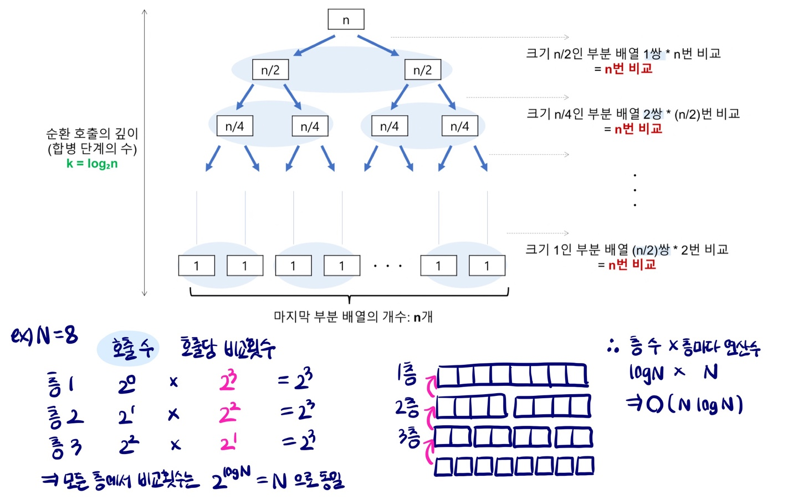

##### 2. Merge Sort Time Complexity Proof

```python
def merge_sort(unsorted_list):
    if len(unsorted_list) <= 1:
        return unsorted_list
	
    mid = len(unsorted_list)//2
    left = unsorted_list[:mid]
    right = unsorted_list[mid:]
    
    # devide : 비교 연산 X, 이동연산 X
    left1 = merge_sort(left)
    right1 = merge_sort(right)
    
    # conquer : 비교 연산 = NlogN
    return merge(left1, right1)

# O(NlogN)

def merge(left, right):
    i = 0
    j = 0
    sorted_list = []
    
    while (i<len(left)) & (j<len(right)):
        if left[i] < right[j]:
            sorted_list.append(left[i])
            i += 1
        else:
            sorted_list.append(right[j])
            j += 1
   
	while (i<len(left)):
        sorted_list.append(left[i])
        i += 1
    
    while (j<len(right)):
        sorted_list.append(right[j])
        j += 1
        
    return sorted_list
```



<br>

##### 4. 최대 Swap 횟수


<br>

##### 6. 

```
[000]--+--[자식1]-----[1의자손]
+--[자식2]
	...
L--[마지막자식]-----[자식의자식]
```

