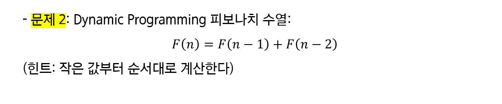

# 동적 프로그래밍

> 함께 학습하고 고민하고 설명하며 작은 부분 하나라도 '내 것'으로 만들어보세요. 😁


## 2번




정확성 증명

```
n=k일 때,

fibonacci(1) ... fibonacci(k-1)이 F(1)...F(k-1)과 같다고 가정

이때 F(k) = F(k-1) + F(k-2)이므로 fibonacci(k) = fibonacci(k) = fibonacci(k-1) + fibonacci(k-2) = F(k) 성립

따라서 fibonacci(n)을 호출하면 F(n)을 리턴
```


시간복잡도: O(n)

```
Fn 은 F(n-1), F(n-2), … , F2, F1, F0의 하위구조로 나눌 수 있는 것을 알 수 있다.

F1, F0 는 이미 정의되어 있는 값을 저장하면 되고, F2부터는 저장된 값을 이용하여 답을 구해 나간다.

계속 구해나가면 Fn의 값을 구할 수 있다.

이로써 계산횟수는 N이 되기 때문에

피보나치 수의 시간 복잡도는 O(n)이다.
```


