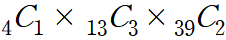
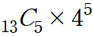

# 3. 집합과 조합(안재영, 장효정, 정미소, 최상진)

### 문제 3.

하나의 원소가 부분집합에 포함되거나 포함되지 않기 때문에 가능한 경우의 수는 2가지이다.

n개의 원소에 대한 경우의 수는 2 X 2 X 2 X ... X 2 이므로 2^n 이다.

### 문제 10.

숫자 4개 : 10^4 = 10000

숫자 5개 : 10^5 = 100000

숫자 6개 : 10^6 = 1000000

따라서 1,110,000가지

### 문제 13.

    

스페이스, 다이아몬드, 하트, 클로버 중에 하나를 고르고

그 문양의 13장의 카드 중 3장이 같은 카드이면서

나머지 39장의 카드 중 무늬 상관 없이 2장을 뽑는 경우의 수는 847,704 가지

### 문제 16.

    

13개의 숫자 중 다른 5개의 숫자를 뽑고

각 카드의 숫자가 다르므로 가능한 무늬는 카드 당 4가지 이므로...1,317,888 가지

