# CSS

### - Flex

- 요소

  - 부모 : container
  - 자식 : item

- 축

  - content(여러줄) / items(한줄) / self(flex item 개별 요소)
  - main axis(메인축)
    - 방향 : justify-content    -row,row-reverse, column, column-reverse
  - cross axis(교차축)
    - 방향 : align-items(/self)	

  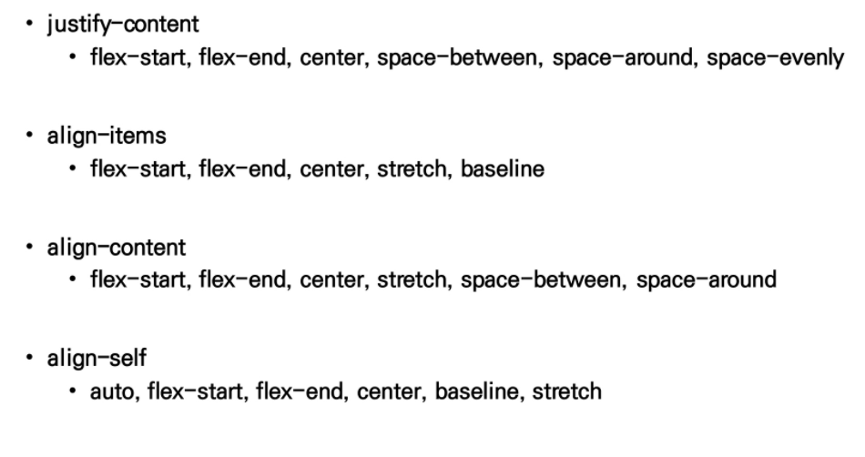

1. 메인 축 방향 

   ```css
   flex-directions: row;
   ```

2. 전체덩어리(content) 정렬

   ```css
   justify-content: center;
   ```

3. 전체에서 가운데 정렬

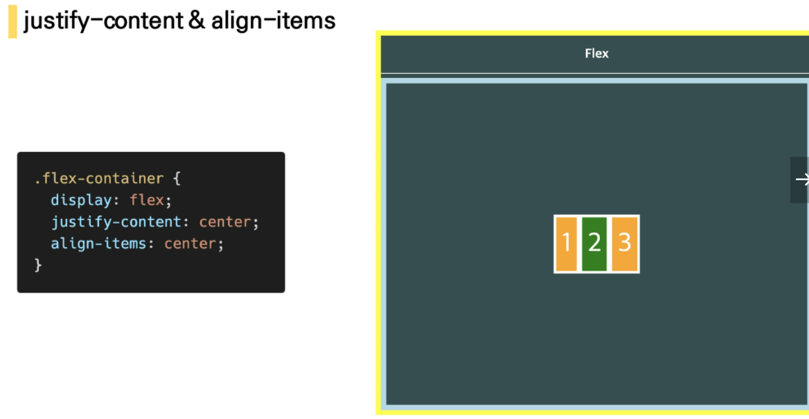


4. 개별 스타일링

   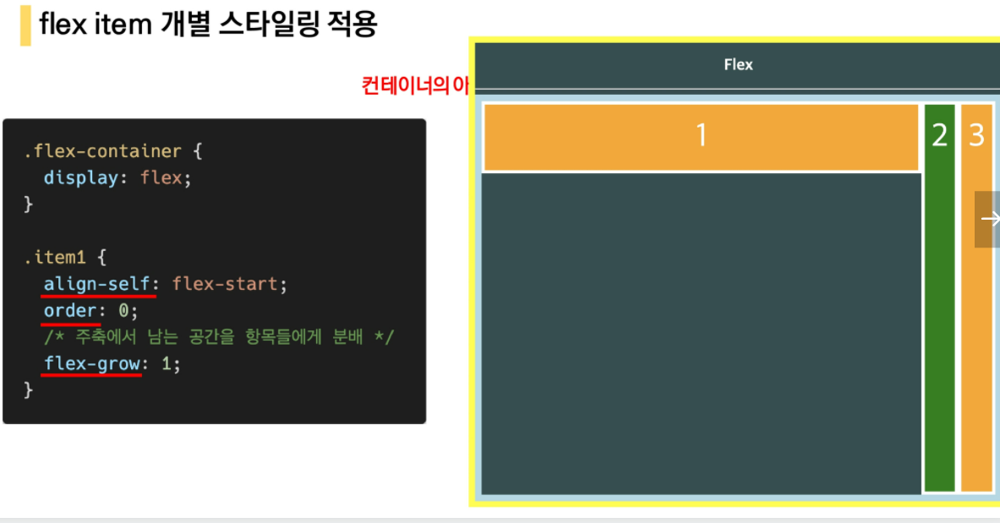


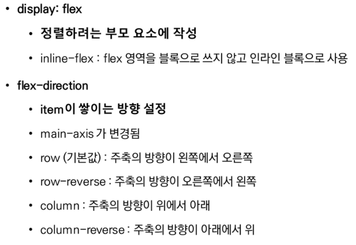

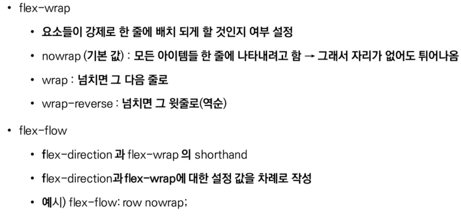

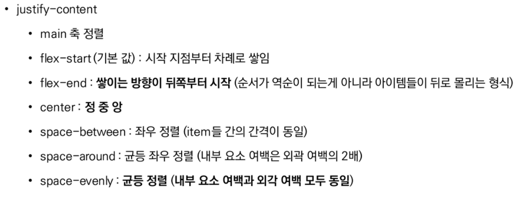

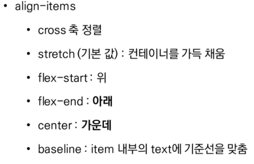

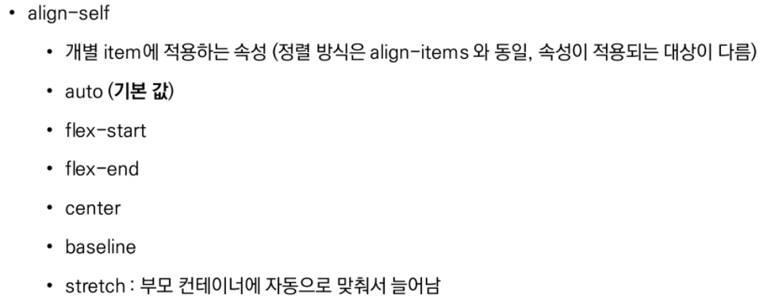


# bootstrap

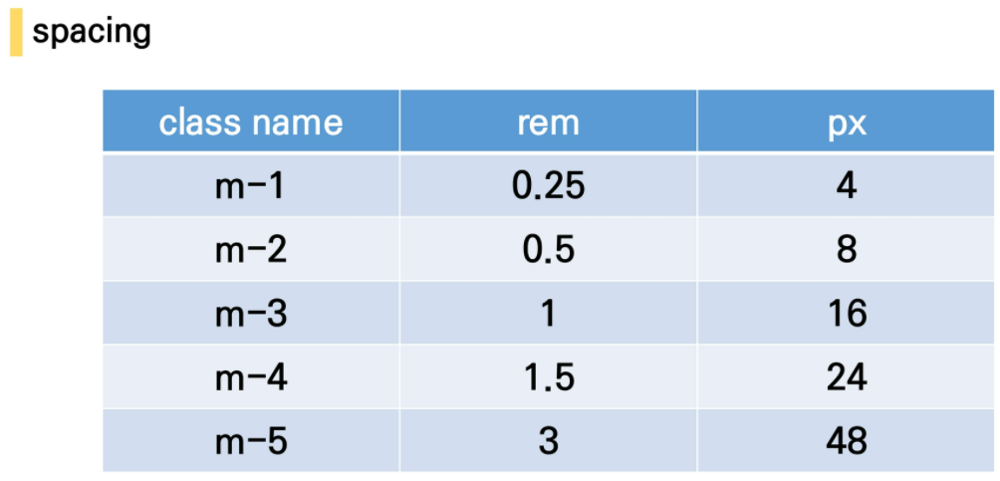

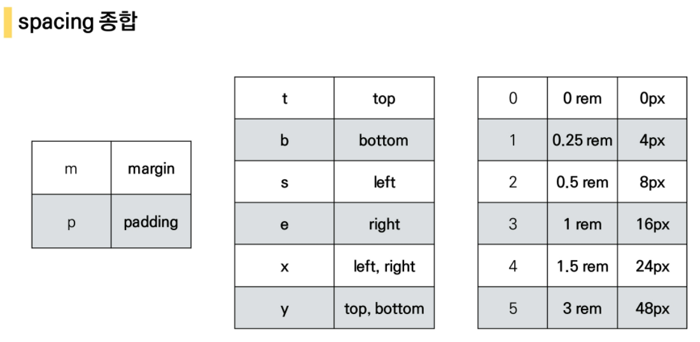


### text

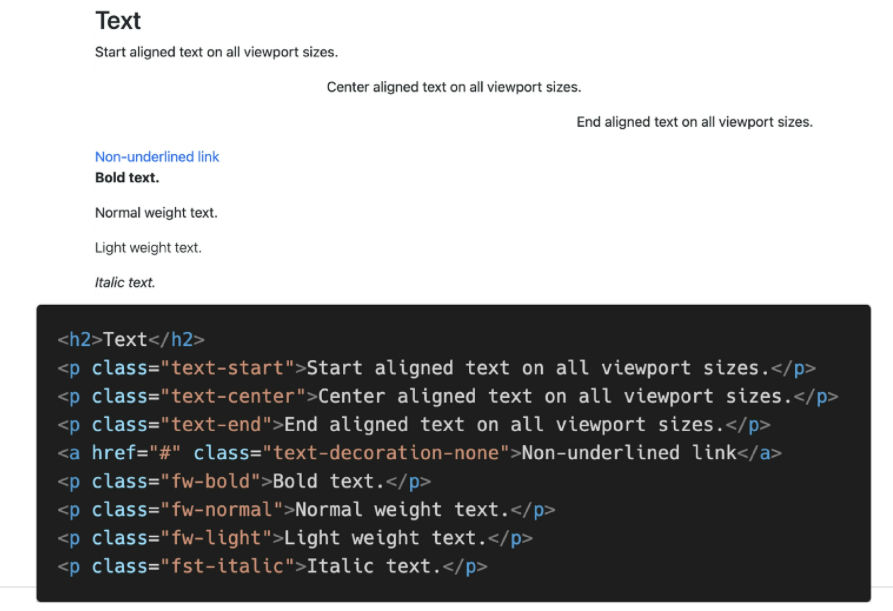

- 부트스트랩에서 flex하려면 class에 d-flex


##### 그리드 시스템

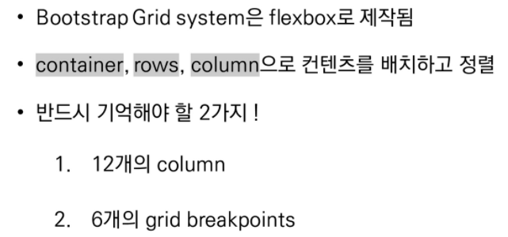