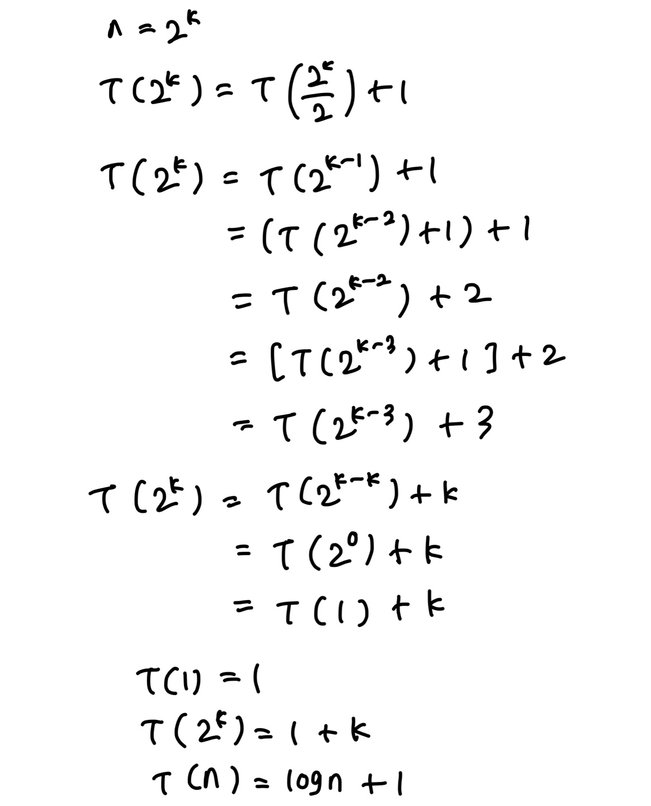

# 기초 수식

> 함께 학습하고 고민하고 설명하며 작은 부분 하나라도 '내 것'으로 만들어보세요. 😁


## 2 번


- `T(0) = 1`로 설정하고 진행

O(n^2)

```
T(n) = T(n-2) + n-1 + n

T(n) = T(n-3) + n-2 + n-1 + n
.
.
.

T(n) = T(n-k) + kn - k(k-1)/2    ...(1)
```

```
T(n) = T(1) + (n-1)n - (n-1)(n-2)/2
```


## 4번


- `T(1) = 1`로 설정하고 진행

O(nlog(n))




## 6번


O(nlog(n))

```
1)T(n) = 2(T(n/2) +n

2) T(n/2) = 2T(n/2^2) + n/2

2식을 1번에 대입

 

T(n) = 2[2T(n/2^2) + n/2] + n

3) T(n)=(2^2)T(n/2^2) + n + n

 

4) t(n/2^2) = 2T(n/2^3) + n/2^2

4식을 3식에 대입

T(n) = (2^3)T(n/2^3) +3n

 

과정을 반복...

 

T(n) = (2^k)T(n/2^k) + kn

T(n/2^3) = T(1)이 되어야하므로

n/2^3 = 1

n = 2^k

k = log(n)

T(n) = (2^k)T(n/2^k) + kn = nT(1) + nlog(n)

따라서 O( nlog(n) )
```


## 8번


O(log(n))

```
T(n) = T(0) + ∑ k=1 부터 n까지 1/n

∑ k=1 부터 n까지 1/n <= 1+∫1부터 k까지 1/k dk

= 1 + log(n) - log1

= 1 + log(n)

따라서 O(log(n))
```


## 참고 자료

https://www.radford.edu/~nokie/classes/360/recurrence.eqns.revised.html
