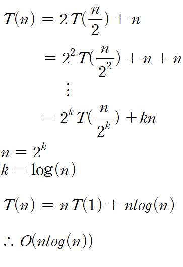
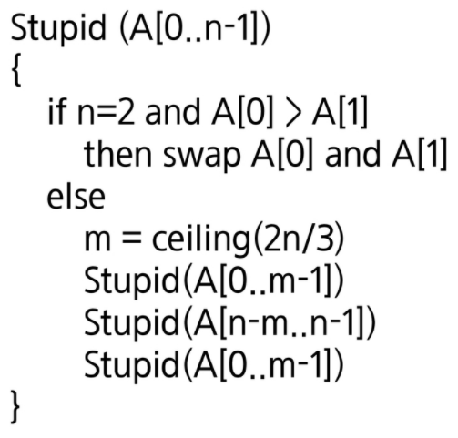

# 5. 재귀(안재영, 장효정, 정미소, 최상진)

### 문제 2.

Pseudo Code

```
MergeSort(A, p, r)
	if p < r
		q = (p + r) / 2
		MergeSort(A, p, q)
		MergeSort(A, q+1, r)
		Merge(A, P, q, r)
	else
		return
```



### 문제 4.


