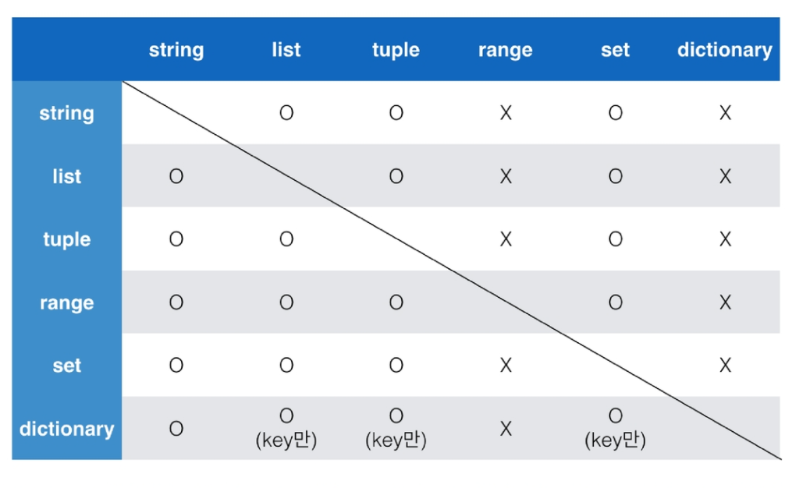

# python 1주차(07.19~23)


### 진수표현

- 2진수 : 0b
- 8진수 : 0o
- 16진수 : 0x


### 실수 연산 과정 주의

- 3.14 - 3.02 == 0.12    ---> FALSE
- 3.14 - 3.02 = 0.1200000000000000
- 매우 작은 수보다 작은지를 확인하거나 `math` 모듈 활용


### divmod (5, 2) => (2, 1)

5를 2로 나눈 몫과 나머지를 출력하는 모듈


### 특정 요소 속해있는지 확인

```python
'a' in 'apple'
```

True


### is 연산자 

동일한 객체인지 확인 가능함

```python
a = 3
b = 3
print (a is b)
```

True


### indexing / slicing

```python
'hello'[0]  --> 'h'
'hello'[1:3] -->'el'
```


### 컨테이너

- sequence형 : 순서가 있는 데이터( != 정렬되어 있다.)

: list, tuple, range, string, binary

- non-sequence형 : 순서가 없는 데이터 

: set, dictionary


### tuple

- 변경 불가
- b = (1, ) : 하나의 항목으로 구성된 튜플 생성시에 쉼표 필수 

### range

- (n, m, s) : n포함 m 미만 s만큼

### set

순서 없다, 중복 없다, 특정값으로 접근 x, 

``` python
{1,2,3,1,2}
```

-> {1, 2, 3}

### dictionary

key를 통해 value에 접근가능

```python
dict_c = {'a': 'apple','b': [1,2,3]}
(위 아래 같은 문장)
dict_c = dict(a='apple', b=[1,2,3])

dict_c['b'][0] 
```

1


## 시퀀스에서 사용함수

### min, max

최솟/최댓값 확인 

### ord, chr

ascii코드로 변환, 글자로 변환

### count : 시퀀스에서 특정 원소의 개수

```python
[1,2,1,2,4].count(1)
```

-> 2


### 컨테이너 형변환 




### for문

for <변수명> in <iterable>:

-> iterable (string, tuple, list, range)


## 함수

### enumerate : index값을 같이 출력

```python
memebers = ['민수','철수','영희']
for idx, member in enumerate(members):
    print(idx, member)
```

0 민수

1 철수

2 영희


### 이름검색규칙

- Local scope : 함수
- Enclosed scope ; 특정 함수의 상위 함수
- Global scope : 함수 밖의 변수, Import 모듈
- Built-in scope: 파이썬 안에 내장되어 있는 함수 또는 속성


# 예외 처리/발생

- 예외처리

try문 

 except

- 예외 발생

raise <표현식> (메시지)

assert <표현식> , <메시지>
